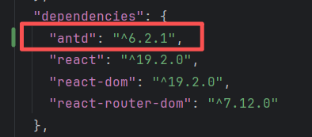

#### 工程化项目创建
#### 1. 目录结构
 ```text
 |-src
    |- api              接口
    |- components       组件
    |- config           配置
    |- hook             自定义hook
    |- layout           布局
    |- router           路由
    |- types            ts定义
    |- utils            工具
    |- views            页面
 ```
#### 2.组件安装
`yarn add react-router-dom`
#### 2.1 引入配置
- [tsconfig.json](tsconfig.json)
```js
"compilerOptions"
:
{
    "baseUrl"
:
    "./",//空间目录
        "paths"
:
    {
        "@/*"
    :
        ["src/*"]//映射src下的所有
    }
}
```
- [vite.config.ts](vite.config.ts)
```js
import {defineConfig} from 'vite'
import react from '@vitejs/plugin-react'
import path from 'path'

// https://vite.dev/config/
export default defineConfig({
    //服务相关配置
    server: {
        host: 'localhost',
        port: 6001,
        proxy: {
            '/api': 'http://xxxx'
        }
    },
    //@路径配置
    resolve: {
        alias: {
            '@': path.resolve(__dirname, './src')
        }
    },
    plugins: [react()],
})

```
#### 2.2 路由创建
~~~js
import {createBrowserRouter, Navigate} from "react-router-dom";
// @ts-ignore
import Welcome from '@/views/Welcome.tsx';
// @ts-ignore
import Tips404 from '@/views/Tips404';
/*todo 查看报错问题原因*/
// @ts-ignore
import Tips403 from '@/views/Tips403';
// @ts-ignore
import Login from '@/views/Login';

const router = [
    {
        path: '/',
        element: <Welcome/>
    },{
        path:"/login",
        element: <Login/>
    },{
        path:"/403",
        element: <Tips403/>
    },
    {
        path:"/404",
        element: <Tips404/>
    },{
        path:"*",
        element: <Navigate to='/404'/>
    }
]
export default createBrowserRouter(router)
~~~
#### 2.3 antd ui组件安装
- [ant designer](https://ant-design.antgroup.com/docs/react/use-with-vite-cn)
- 安装
```shell
yarn add antd
```
- [package.json](package.json) antd 版本
- 
#### 2.4 使用 Ant Designer 配置403/404页面内容
- [ant Result 组件](https://ant-design.antgroup.com/components/result-cn)
- 关联前序 useNavigate hook 页面跳转的使用
```tsx
import {Button, Result} from "antd";
import {useNavigate} from "react-router-dom";

function Tips404() {
    /*使用 useNavigate 跳转首页*/
    const navigate = useNavigate()
    const handleOnClick = () => {
        navigate("/")
    }

    return (
        <Result
            status="404"
            title="404"
            subTitle="抱歉、当前访问页面不存在."
            extra={ <Button type="primary" onClick={ handleOnClick }>返回首页</Button> }
        />
    )
}

export default Tips404
```
#### 3.请求组件 axios 的封装
##### 3.1 (官网资料)[https://www.npmjs.com/package/axios?activeTab=readme]
##### 3.2 添加 axios 工具包
```shell
yarn add axios
```
##### 3.3 基础请求方式的封装
```ts
import axios from "axios";
/*封装 axios 的get/post请求 */
let instance:any = axios.create({
    baseURL: 'http://localhost:7001/',
    timeout: 1000,
    timeoutErrorMessage:"请求超时，请稍后重试",//请求超时文案
    withCredentials:true,//默认跨域
    headers: {'X-Custom-Header': 'foobar'}
});

export default {
    get(url:string,params:any){
        return instance.get(url, {params});
    },
    post(url:string,params:any){
        return instance.post(url, params);
    }
}
```
##### 3.4 请求的发送
`http://localhost:5173/axios`
```ts
//路由配置新增
{
    path: '/axios',
    element: <TestReq/>
}
```
```tsx
//页面组件
import {useEffect} from "react";
import request from "../utils/request";

function TestReq() {
    useEffect(()=>{
        request.get(
            "/roles",
            {"id": 11212}
        ).catch((error:any)=>{
            console.log(error)
        })
    },[])
    useEffect(()=>{
        request.post(
            "/admin",
            {"tt": 213}
        ).catch((error:any)=>{
            console.log(error)
        })
    },[])
    return (
        <>
            <div className="hdr"> 测试通过 Axios 发送请求 </div>
        </>
    )
}

export default TestReq
```
#### 4. 引入 ant design 加载组件 <Spin/>
[Spin组件使用说明](https://ant-design.antgroup.com/components/spin-cn)
##### 4.1 引入antd的<Spin/> 元素（需由函数组件包裹）
```tsx
    import {Spin} from "antd";
    //引入样式
    import './load.less'
    //需要子元素包裹才会显示 tip 值
    const content = <div style={{padding:50,background: 'rgba(0, 0, 0, 0.05)', borderRadius: 2,}}/>
    //包装组件 提示信息可传入，默认值 'loading'
    function Loading({tips='loading'}:{tips:string}){
        return <Spin tip={tips} size='large' className='request-loading'>
            {content}
        </Spin>
    }
    export default Loading
```
##### 4.2 创建显示和隐藏加载组建的方法
```tsx
    //展示加载组件
    import ReactDom from "react-dom/client";
    import Loading from "../../utils/loading/Loading";
    let count = 0
    export const showLoading = () => {
        if (count === 0) {
            //创建html节点
            const loading = document.createElement("div");
            loading.setAttribute('id','loading')
            //元素追加到body中
            document.body.appendChild(loading)
            //渲染组件
            ReactDom.createRoot(loading).render(<Loading tips='加载中...'/>)
        }
        count++;
    };
    //隐藏加载组件
    export const hideLoading = () => {
        if (count > 0) {
            count--;
        }
        if (count === 0) {
            document.body.removeChild(document.getElementById('loading') as HTMLDivElement);
        }
    };
```
##### 4.3 js id选择器为引入的加载组件添加样式 
- 安装 less ` yarn add less`
- 写样式
```less
    #loading {
      position: fixed;
      top: 0;
      bottom: 0;
      left: 0;
      right: 0;
      display: flex;
      align-items: center;
      justify-content: center;
      font-size: 20px;
    }
```
- 引入 见 4.1

#### 5.引入css 动画搭配iconfont完成加载组件
- (iconfont)[https://www.iconfont.cn/?spm=a313x.search_index.i3.2.7b043a81w1xIO1]
- (css动画演示)[https://www.runoob.com/css3/css3-animations.html]
  - animation: name duration timing-function delay iteration-count direction fill-mode play-state;
##### 5.1 引入一个icon并设置动画
- index 页面新增div 并插入 svg 代码
- 为 svg class 添加样式
```css
    .svgLoad{
        animation: aniSvg linear 2s infinite;
    }
    @keyframes aniSvg {
        from{
            /*从某个角度旋转开始*/
            transform: rotate(0deg);
        }
        to{
            transform: rotate(360deg);
        }
    }
```
##### 5.2 封装 localStorage API
```ts
// 封装针对 localStorage 工具类
export default {
    set(key: string, val: any) {
        localStorage.setItem(key, JSON.stringify(val));
    },
    get(key: string){
        const value = localStorage.getItem(key)
        if (value)
        try {
            return JSON.parse(value)
        }catch (error){
            return value
        }
    },
    del(key:string){
        localStorage.removeItem(key)
    },
    clear(){
        localStorage.clear()
    }
}
```
- 组件中测试使用
```tsx
  // @ts-ignore
import {showLoading} from "@/utils/loading";
import {Button} from "antd";
//@ts-ignore
import storage from "@/utils/storage";

function TestStorage() {
  const handleInsert = (type: number) => {
    if (type === 1) {
      storage.set("f", 1234);
      storage.set("product", {id: 1, type: 'phone', price: 1399})
    } else if (type === 2) {
      console.log(storage.get('product'))
    } else if (type === 3) {
      storage.del('f');
    } else {
      storage.clear();
    }
  }

  return (
          <>
            <div className="bt">
              <Button onClick={ () => handleInsert(1) }>新增</Button>
            </div>
            <div className="bt">
              <Button onClick={ () => handleInsert(2) }>获取</Button>
            </div>
            <div className="bt">
              <Button onClick={ () => handleInsert(3) }>删除</Button>
            </div>
            <div className="bt">
              <Button onClick={ () => handleInsert(4) }>清空</Button>
            </div>
          </>
  )
}

export default TestStorage
```